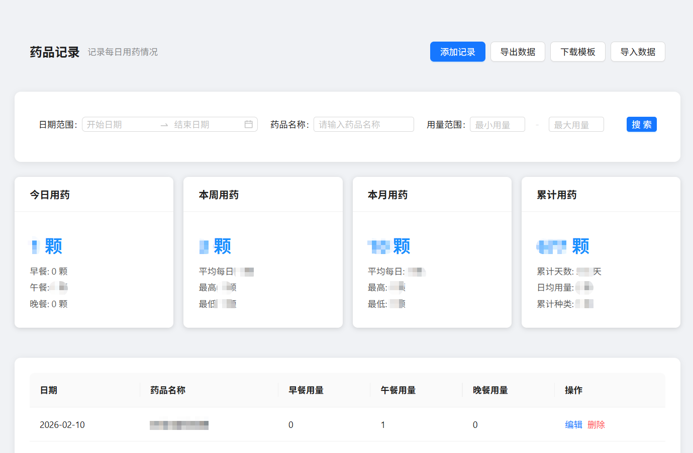
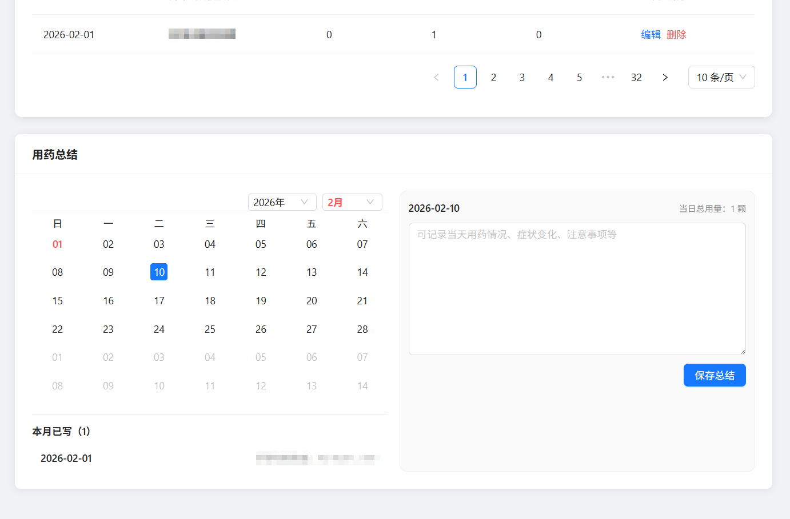

# 用药记录管理

一个用于记录每日用药情况的 Web 应用。




## 功能特点

### 用药记录
- 记录每日用药情况（早餐、午餐、晚餐）
- 支持添加、编辑、删除记录
- 添加记录支持"确定后继续添加"的快速录入
- 支持按日期、药品名称、用量范围筛选数据

### 购买记录（新增）
- 记录每次药品购买的数量、渠道、价格等信息
- 支持设置单位（盒/瓶/支/袋/板/粒等）
- 支持记录购买渠道（药店/京东/淘宝/拼多多）
- 自动计算总价（单价 × 数量）
- 提供购买统计概览（购买次数、总数量、总花费）
- 支持按日期、药品名称筛选

### 数据管理
- 支持导出数据为 CSV/Excel 格式
- 支持导入 Excel/CSV 数据
- 提供用药总结功能（按日期记录）
- 提供用药统计功能（今日、本周、本月）
- 提供用药趋势图表

### 其他
- 响应式布局，适配移动端
- 自定义 SVG 网站图标

## 技术栈

### 前端
- Vue 3 + Vite
- Ant Design Vue
- Pinia + Axios
- Dayjs + ECharts
- PapaParse + XLSX

### 后端
- Node.js + Express
- MySQL2
- CORS + Dotenv

## 目录结构

- frontend：前端代码
- backend：后端代码
- backend/config/init.sql：数据库初始化脚本

## 开发环境配置

## 环境要求

- Node.js（建议 18+）
- MySQL（建议 5.7/8.0）

## 安装依赖

在两个目录分别安装依赖：

```bash
cd backend && npm install
cd ../frontend && npm install
```

## 启动开发服务器

需要两个终端分别启动后端与前端。

1. 启动后端（默认端口 9500）：

```bash
cd backend
npm run dev
```

2. 启动前端（默认端口 9000）：

```bash
cd ../frontend
npm run dev
```

## 数据库配置

1. 确保 MySQL 服务已启动
2. 复制.env.example为.env：
```bash
cp backend/.env.example backend/.env
```

Windows PowerShell 也可以使用：
```bash
Copy-Item backend/.env.example backend/.env
```

3. 配置数据库连接（.env）：
```bash
DB_HOST=localhost
DB_PORT=3306
DB_USER=your_username
DB_PASSWORD=your_password
DB_NAME=medication_db
```

后端启动时会自动创建数据库并执行 [init.sql](backend/config/init.sql) 初始化表结构。

## 端口与代理

- 前端：默认 http://localhost:9000
- 后端：默认 http://localhost:9500
- 开发代理：前端请求 /api 会代理到后端（见 frontend/vite.config.js）

## 接口说明

### 用药记录接口
- GET /api/records：获取记录列表
- POST /api/records：新增记录
- PUT /api/records/:id：更新记录
- DELETE /api/records/:id：删除记录
- DELETE /api/records/batch：批量删除记录

### 购买记录接口（新增）
- GET /api/purchase-records：获取购买记录列表
- POST /api/purchase-records：新增购买记录
- PUT /api/purchase-records/:id：更新购买记录
- DELETE /api/purchase-records/:id：删除购买记录
- DELETE /api/purchase-records/batch：批量删除购买记录
- GET /api/purchase-stats/overview：获取购买统计概览

### 用药总结接口
- GET /api/daily-summaries：获取每日总结列表
- PUT /api/daily-summaries/:date：保存/更新每日总结

### 统计接口
- GET /api/stats/overview：获取用药统计概览

## 构建与预览（前端）

```bash
npm run build
npm run preview
```

## 数据导入模板

### 用药记录模板
支持 Excel (.xlsx) 和 CSV 格式。

推荐在页面点击"下载模板"，在模板中补充数据后再导入。表头支持以下字段名（中英文均可）：

- date / 日期（YYYY-MM-DD）
- medicineName / 药品名称
- breakfast / 早餐用量
- lunch / 午餐用量
- dinner / 晚餐用量

### 购买记录导出
可在购买记录页面点击"导出数据"，导出 Excel 文件包含以下字段：

- 购买日期（YYYY-MM-DD）
- 药品名称
- 数量
- 单位
- 单价
- 总价
- 购买渠道
- 备注
